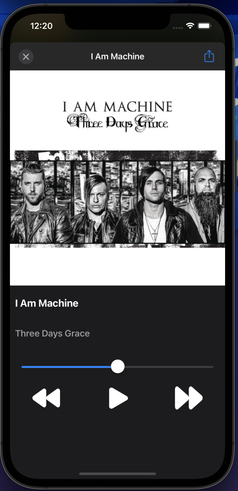

# Music
## Getting Started ##

1. git clone https://github.com/singhbaidwan  
2. cd Music. 
3. pod install (requires CocoaPods). 
4. Open Music.xcworkspace in Xcode 8.0 or higher. 
5. Visit [Spotify Developer](https://developer.spotify.com) website to register yourself as developer and create an app on spotify developer website. 
6. After registering App, copy clientID and clientSecret to Constants.clientID and Constants.clientSecret inside AuthManager.swift file 
## Screenshots ##

<table>
<tr>
<td></td>
<td> </td>
<td></td>
</tr>
<tr>
<td>Launch Screen</td>
<td>Login Screen</td>
<td>Browse Screen</td>
</tr>
</table>

<table>
<tr>
<td></td>
<td></td>
<td> </td>
</tr>
<tr>
<td>Search Screen</td>
<td>Search Result - showing(aritst,playlist,songs)</td>
<td>Library Section of user</td>
</tr>
</table>

<table>
<tr>
<td></td>
<td></td>
<td> </td>
</tr>
<tr>
<td>Playlist View</td>
<td>Album View</td>
<td>Music Controller View</td>
</tr>
</table>

